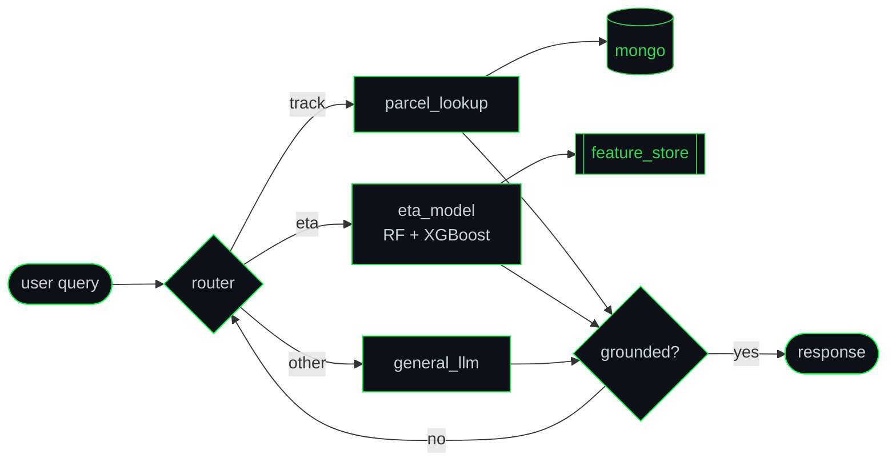

```
███╗   ██╗██╗██╗   ██╗ █████╗ ██╗  ██╗ █████╗ ██████╗  █████╗ ███╗   ██╗
████╗  ██║██║██║   ██║██╔══██╗██║ ██╔╝██╔══██╗██╔══██╗██╔══██╗████╗  ██║
██╔██╗ ██║██║██║   ██║███████║█████╔╝ ███████║██████╔╝███████║██╔██╗ ██║
██║╚██╗██║██║╚██╗ ██╔╝██╔══██║██╔═██╗ ██╔══██║██╔══██╗██╔══██║██║╚██╗██║
██║ ╚████║██║ ╚████╔╝ ██║  ██║██║  ██╗██║  ██║██║  ██║██║  ██║██║ ╚████║
╚═╝  ╚═══╝╚═╝  ╚═══╝  ╚═╝  ╚═╝╚═╝  ╚═╝╚═╝  ╚═╝╚═╝  ╚═╝╚═╝  ╚═╝╚═╝  ╚═══╝
                    [ ML ENGINEER ]  ::  [ FULL STACK ]
```

<p align="center">
  
</p>

<p align="center">
  <a href="https://github.com/Nivakaran-S"></a>
  <a href="https://linkedin.com/in/nivakaran"></a>
  <a href="https://huggingface.co/Nivakaran"></a>
  <a href="https://nivakaran.dev"></a>
  <a href="mailto:nivakaran@hotmail.com"></a>
  
</p>

---

## `$ nvidia-smi`

```
+-----------------------------------------------------------------------------+
| NIVAKARAN-SMI 2026.07      Driver Version: 5.0.1       CUDA Version: 12.4    |
|-------------------------------+----------------------+----------------------+
| GPU  Name         Persist-M   | Bus-Id         Disp.A | Volatile Uncorr. ECC |
| Fan  Temp  Perf   Pwr:Usage   |          Memory-Usage | GPU-Util  Compute M. |
|===============================+======================+======================|
|   0  Curiosity          On    | 00000000:01:00.0  Off |                  N/A |
| 42%   67C    P2    240W/250W  |   15104MiB/16384MiB   |     98%      Default |
+-------------------------------+----------------------+----------------------+

+-----------------------------------------------------------------------------+
| Processes:                                                                   |
|   GPU   PID   Type   Process name                              GPU Memory     |
|=============================================================================|
|     0  2201      C   ecoharvest/efficientnet_b0_food101          4210MiB     |
|     0  2202      C   sparrow/eta_xgboost_ensemble                3180MiB     |
|     0  2203      C   sparrow/langgraph_agent_runtime             2940MiB     |
|     0  2204      C   book_rec/hf_sentence_embeddings             2016MiB     |
|     0  2205      C   classifier/custom_cnn_3class                1014MiB     |
|     0  ????      C   next_experiment                             [PENDING]   |
+-----------------------------------------------------------------------------+
```

---

## `$ cat model_card.yaml`

```yaml
model_id:      nivakaran-shanmugabavan
architecture:  Full Stack Developer × ML / AI Engineer
base_model:    B.Sc (Hons) Information Technology @ SLIIT
               └── specialization: Software Engineering
region:        Colombo, Sri Lanka  ·  UTC+05:30
context:       clinical documentation · agentic systems · data pipelines
license:       open-to-collaborate
status:        actively fine-tuning

intended_use:
  - end-to-end ML systems that reach production, not just notebooks
  - agentic workflows with real tool-calling and real failure modes
  - healthcare tech where domain knowledge is the bottleneck

out_of_scope:
  - shipping a demo and calling it a system
```

Most people arrive at ML from mathematics. I arrived from **watching US cardiologists work** — transcribing encounters in real time for two and a half years, seeing exactly where clinical workflows break and where software could have caught it. That's the prior I train on: *what does this actually solve, and for whom?*

---

## `$ tail -f logs/train.log`

```console
nivakaran@sliit:~$ tail -f logs/career/train.log

[2022-02]  epoch 01/∞   loss 1.0000   init  :: customer_service @ startek → commercial bank
[2022-07]  epoch 02/∞   loss 0.7412   transfer :: clinical documentation, us cardiology
[2024-07]  epoch 03/∞   loss 0.5108   unfroze :: tensorflow · deep learning
[2024-12]  epoch 04/∞   loss 0.3874   augment :: generative ai · langchain · huggingface
[2025-02]  epoch 05/∞   loss 0.2996   expand  :: machine learning + data science
[2025-04]  epoch 06/∞   loss 0.2341   vision  :: pytorch · tensorflow · cnn architectures
[2025-05]  epoch 07/∞   loss 0.1902   nlp     :: transformers · embeddings · deep learning
[2025-06]  epoch 08/∞   loss 0.1548   agents  :: langgraph · langchain · tool calling
[2025-07]  epoch 09/∞   loss 0.1237   scale   :: spark · kafka · airflow · gcp · azure

>>> early_stopping = False
>>> checkpoint saved. training continues.
```

---

## `$ python -c "from nivakaran import Engineer; print(Engineer())"`

```python
Engineer(
  (domain): Prior(
    healthcare_documentation = True,   # 2.5 yrs, US cardiology
    customer_facing          = True,   # banking, high-volume
  )
  (languages): ModuleList(
    Python, TypeScript, JavaScript, Java, Kotlin
  )
  (ml): Sequential(
    (0): Frameworks(PyTorch, TensorFlow, Scikit-learn, HuggingFace)
    (1): Agentic(LangChain, LangGraph, Groq)
    (2): Classical(RandomForest, XGBoost, CosineSimilarity)
    (3): Vision(CNN, EfficientNet-B0, transfer_learning=True)
  )
  (data): Pipeline(
    stores  = [MongoDB, PostgreSQL, Oracle],
    compute = [Hadoop, Spark, Kafka],
    orchestr= [Airflow, MLflow, Databricks],
  )
  (serving): Sequential(
    (0): Backend(FastAPI, Flask, Node.js)
    (1): Frontend(Next.js, React Native)
    (2): Infra(Docker, AWS, GCP, Azure, Vercel, HF Spaces)
  )
)

Total params:      8 certifications · 4 systems in production
Trainable params:  all of them
Frozen params:     0
```

<p align="center">
  
</p>

---

## `$ mlflow experiments list --view=active`

```
EXPERIMENT          ARTIFACT                          STATUS     PRIMARY METRIC
──────────────────────────────────────────────────────────────────────────────
ecoharvest          efficientnet_b0 + agentic_rag     FINISHED   food-101 classification
sparrow             xgboost_eta + langgraph_agent     FINISHED   last-mile ETA regression
book_recommender    hf_embeddings + cosine_sim        FINISHED   semantic top-k retrieval
image_classifier    custom_cnn_3class                 FINISHED   cat/dog/person accuracy
──────────────────────────────────────────────────────────────────────────────
4 runs · all deployed · all publicly reachable
```

### `[run:0] ecoharvest` — surplus food marketplace
**`→`  [ecoharvest.nivakaran.dev](https://ecoharvest.nivakaran.dev)**
```diff
+ problem   :: edible surplus goes to landfill while demand exists
+ vision    :: EfficientNet-B0 fine-tuned on Food-101 for item recognition
+ agent     :: agentic AI handling customer queries end to end
+ platform  :: Next.js · TypeScript · Node.js · Express · MongoDB
! outcome   :: full supplier→consumer marketplace, live
```

### `[run:1] sparrow` — intelligent parcel management
**`→`  [sparrow.nivakaran.dev](https://sparrow.nivakaran.dev)**
```diff
+ problem   :: last-mile ETAs are guesses; tracking is manual
+ model     :: Random Forest + XGBoost ensemble on logistics features
+ agent     :: LangGraph state machine + Groq LLMs for tracking workflows
+ backend   :: Node.js parcel consolidation platform
+ serving   :: HF Spaces (agent + ETA pipeline) · Vercel (services)
```

Agent topology (`sparrow/graph.py`):



### `[run:2] book_recommender` — semantic NLP engine
**`→`  [nivakaran-book-recommendation.hf.space](https://nivakaran-book-recommendation.hf.space)**
```diff
+ problem   :: keyword search can't answer "something for how I feel right now"
+ embed     :: HuggingFace sentence embeddings over book descriptions
+ retrieve  :: cosine similarity, description-driven and mood-driven modes
+ serving   :: Flask on HF Spaces
```

### `[run:3] image_classifier` — custom CNN, 3-class
**`→`  [gradio demo](https://nivakaran-classification-gradio-kncvu.hf.space/?__theme=system)**
```diff
+ scope     :: cat / dog / person, convolutional net built from scratch
+ stack     :: PyTorch · Gradio · live inference endpoint
+ purpose   :: architecture intuition before reaching for pretrained weights
```

---

## `$ pip list | grep -Ei "cert|bootcamp"`

```console
nivakaran@sliit:~$ pip list --format=columns

Package                                   Version    Installed
───────────────────────────────────────────────────────────────
big-data-engineering[gcp,azure]           2025.7     jul 2025
agentic-ai[langgraph,langchain]           2025.6     jun 2025
advanced-ml-nlp-deep-learning             2025.5     may 2025
computer-vision[pytorch,tensorflow]       2025.4     apr 2025
complete-nodejs[graphql,mongodb]          2025.3     mar 2025
machine-learning-data-science             2025.2     feb 2025
generative-ai[langchain,huggingface]      2024.12    dec 2024
tensorflow-deep-learning                  2024.7     jul 2024
───────────────────────────────────────────────────────────────
8 packages installed. 0 obsolete. ∞ available for upgrade.
```

---

## `$ tail -f /var/log/git/activity.log`

> Rebuilt every 6h by [`update-readme.yml`](.github/workflows/update-readme.yml). Do not edit between the anchors.

<!-- ACTIVITY:START -->
```console
nivakaran-s@github:~$ tail -n 8 /var/log/git/activity.log

  waiting for first CI run...

-- stream not yet synced --
```
<!-- ACTIVITY:END -->

---

## `$ ./contribution_snake --animate`

<p align="center">
  <picture>
    <source media="(prefers-color-scheme: dark)" srcset="https://raw.githubusercontent.com/Nivakaran-S/Nivakaran-S/snake-output/snake-dark.svg"/>
    <source media="(prefers-color-scheme: light)" srcset="https://raw.githubusercontent.com/Nivakaran-S/Nivakaran-S/snake-output/snake-light.svg"/>
    
  </picture>
</p>

---

## `$ tensorboard --logdir ./assets --self-hosted`

<p align="center">
  
</p>

<p align="center">
  
</p>

<details>
<summary><code>$ metrics --source=third-party   # fallback cards</code></summary>
<br/>
<p align="center">
  
  
</p>
<p align="center">
  
</p>
</details>

---

## `$ curl -X POST https://nivakaran.dev/v1/collaborate`

```http
POST /v1/collaborate HTTP/1.1
Content-Type: application/json
```

```json
{
  "status": 200,
  "accepting": [
    "ML Engineer / AI Developer   — internship or full-time",
    "Healthcare Tech              — domain expertise × applied AI",
    "Open source                  — ML, data engineering, agentic systems",
    "Hackathons                   — real problems, tight deadlines"
  ],
  "endpoints": {
    "mail":      "nivakaran@hotmail.com",
    "linkedin":  "linkedin.com/in/nivakaran",
    "github":    "github.com/Nivakaran-S",
    "www":       "nivakaran.dev"
  },
  "latency_p50": "< 24h",
  "region": "asia-south / remote-friendly"
}
```

---

<details>
<summary><code>$ cat .github/BUILD.md   # how this profile builds itself</code></summary>

```
.
├── README.md                       # you are here
├── LICENSE                         # MIT
├── assets/                         # CI-generated SVGs — do not edit
│   ├── metrics.svg
│   └── metrics-habits.svg
└── .github/
    ├── scripts/
    │   └── update_readme.py        # stdlib-only activity feed builder
    └── workflows/
        ├── snake.yml               # daily    → snake-output branch
        ├── metrics.yml             # daily    → assets/*.svg
        └── update-readme.yml       # 6-hourly → README activity block
```

Third-party badge renderers rate-limit and fail. Everything above is generated
in CI and served from this repository, so it renders whether or not someone
else's Vercel instance is having a bad day.

</details>

```console
nivakaran@sliit:~$ echo "thanks for scrolling. now go ship something."
thanks for scrolling. now go ship something.

nivakaran@sliit:~$ █
```